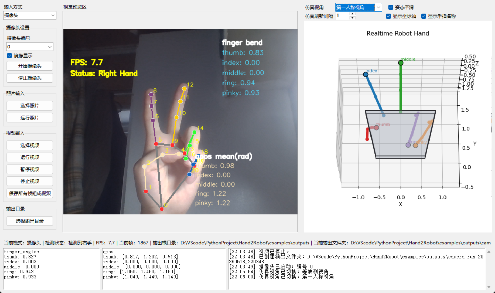

<div align="center">

# Hand2Robot


**基于 MediaPipe 的人手关键点检测、机器人手姿态映射与实时可视化系统**

A lightweight vision-based human hand keypoint detection, robot hand pose mapping and realtime visualization system.

</div>

---

##  项目简介

**Hand2Robot** 是一个面向人手姿态识别、机器人手姿态映射与实时可视化的轻量级项目。

系统基于 **MediaPipe Hands** 提取人手 21 个关键点，进一步计算五指弯曲程度，将其映射为简化机器人手 `qpos`，并通过中文图形化界面实时显示机器人手 3D 仿真姿态。

本项目支持 **摄像头、照片、视频** 三种输入方式，可以实时显示手部关键点、五指弯曲程度、机器人手关节角以及多视角仿真效果，适合作为计算机视觉、机器人控制、人机交互方向的课程设计、项目展示或后续研究基础。

---

##  项目特点

| 功能 | 说明 |
|---|---|
| 摄像头实时检测 | 支持摄像头实时检测人手 21 个关键点 |
| 照片输入 | 支持单张图片手部检测与完整结果保存 |
| 视频输入 | 支持视频逐帧检测、实时预览与结果导出 |
| 21 点关键点显示 | 在画面中绘制 MediaPipe 手部关键点、骨架和编号 |
| 五指弯曲估计 | 计算 thumb / index / middle / ring / pinky 的弯曲程度 |
| qpos 姿态映射 | 将五指弯曲程度映射为简化机器人手关节角 |
| 实时 3D 仿真 | 在 GUI 中实时显示机器人手 3D 姿态 |
| 多视角切换 | 支持第一人称、正面、侧面、俯视、等轴测视角 |
| 姿态平滑 | 支持 qpos 平滑，减少实时可视化抖动 |
| 当前帧保存 | 可保存当前帧图像、landmarks、finger_angles、qpos 和机器人手图 |
| 视频结果导出 | 可导出标注视频、qpos 序列、finger_angles 序列和处理摘要 |
| 独立输出文件夹 | 摄像头、照片、视频每次运行都会生成独立输出目录 |

---

##  效果展示

> 建议将运行截图放到 `docs/images/` 目录下。  
> 如果暂时还没有截图，可以先保留下面的图片引用，后续补图即可。

### GUI 实时检测界面



### 机器人手可视化


### 运行演示 GIF


---

##  项目结构

```text
Hand2Robot/
├── apps/
│   ├── run_gui.py                    # 中文 GUI 主入口
│   ├── run_camera.py                 # 摄像头命令行入口
│   ├── run_image.py                  # 图片命令行入口
│   ├── run_video.py                  # 视频命令行入口
│   ├── run_visualize_qpos.py         # qpos 可视化入口
│   └── run_visualize_demo_poses.py   # 示例姿态可视化入口
│
├── hand2robot/
│   ├── __init__.py
│   ├── detector.py                   # MediaPipe 手部检测封装
│   ├── visualizer.py                 # OpenCV 画面绘制工具
│   ├── finger_angle.py               # 五指弯曲程度计算
│   ├── qpos_mapper.py                # finger_angles 到 qpos 的映射
│   ├── smoothing.py                  # 姿态平滑模块
│   ├── robot_hand_model.py           # 简化机器人手运动学模型
│   ├── robot_hand_visualizer.py      # Matplotlib 机器人手可视化
│   ├── realtime_robot_view.py        # GUI 内嵌实时机器人手视图
│   ├── pipeline.py                   # 摄像头 / 图片 / 视频处理流程
│   ├── export_utils.py               # 结果保存工具
│   ├── hand_geometry.py              # 手掌与手指几何参数
│   └── gui_app.py                    # Tkinter GUI 主界面逻辑
│
├── configs/
│   └── mapping.json                  # qpos 映射配置
│
├── examples/
│   ├── images/                       # 示例图片
│   ├── videos/                       # 示例视频
│   └── outputs/                      # 运行输出结果，默认不上传 GitHub
│
├── docs/                             #空
│   ├── images/                       # README 展示图片
│   └── demo.gif                      # 运行演示动图
│
│
├── tests/
│   ├── test_finger_angle.py          # finger_angle 测试
│   └── test_qpos_mapper.py           # qpos_mapper 测试
│
├── requirements.txt                  # Python 依赖
├── .gitignore                        # Git 忽略规则
├── LICENSE                           # 开源协议
└── README.md                         # 项目说明文档
```

---

##  环境要求

| 项目 | 推荐配置 |
|---|---|
| 操作系统 | Windows 10 / Windows 11 |
| Python | Python 3.10 |
| 环境管理 | Anaconda / Miniconda |
| 摄像头 | 普通 USB 摄像头或笔记本内置摄像头 |
| GPU | 非必须，CPU 即可运行 |

---

##  安装方法

### 1. 创建 Conda 环境

```bash
conda create -n hand2robot python=3.10 -y
conda activate hand2robot
```

### 2. 进入项目目录

```bash
cd /d D:\VScode\PythonProject\Hand2Robot
```

如果你把项目放在其他位置，请将路径替换为你的实际路径。

### 3. 安装依赖

```bash
pip install -r requirements.txt -i https://pypi.tuna.tsinghua.edu.cn/simple
```

如果 `mediapipe` 安装或导入异常，可以尝试重新安装指定版本：

```bash
pip uninstall mediapipe -y
pip install mediapipe==0.10.14 -i https://pypi.tuna.tsinghua.edu.cn/simple
```

验证 MediaPipe 是否正常：

```bash
python -c "import mediapipe as mp; print(mp.__version__); print(hasattr(mp, 'solutions'))"
```

如果输出中出现 `True`，说明 `mp.solutions` 可用。

---

##  快速运行

推荐使用中文 GUI 作为主入口：

```bash
python apps/run_gui.py
```

GUI 支持：

- 摄像头实时检测
- 照片输入检测
- 视频逐帧检测
- 实时显示手部 21 个关键点
- 实时显示机器人手 3D 仿真
- 仿真视角切换
- 姿态平滑
- 当前帧完整结果保存
- 视频连续结果导出
- 每次运行独立输出文件夹

---

##  GUI 使用说明

### 1. 摄像头模式

操作流程：

1. 输入方式选择 **摄像头**
2. 选择摄像头编号，默认 `0`
3. 可选择是否开启 **镜像显示**
4. 点击 **开始摄像头**
5. 中间区域实时显示手部画面和 21 个关键点
6. 右侧区域实时显示机器人手仿真姿态
7. 可切换仿真视角
8. 点击 **保存当前帧完整结果** 保存当前这一帧

摄像头模式保存目录示例：

```text
examples/outputs/camera_run_20260518_184500/
```

保存内容示例：

```text
frame_0001.png
landmarks_0001.json
finger_angles_0001.json
qpos_0001.json
robot_hand_0001.png
qpos_latest.json
```

再次点击保存会生成：

```text
frame_0002.png
landmarks_0002.json
finger_angles_0002.json
qpos_0002.json
robot_hand_0002.png
```

> 摄像头实时显示不会自动保存，只有点击保存按钮时才会保存当前帧。

---

### 2. 照片模式

操作流程：

1. 输入方式选择 **照片**
2. 点击 **选择照片**
3. 点击 **运行照片**
4. 系统显示标注后的照片
5. 右侧显示该照片对应的机器人手姿态
6. 自动保存该照片完整结果

照片模式保存目录示例：

```text
examples/outputs/image_run_20260518_185010/
```

保存内容示例：

```text
original_image.png
annotated_image.png
landmarks.json
finger_angles.json
qpos.json
qpos_latest.json
robot_hand.png
```

如果照片中没有检测到手，系统会在日志中提示，并保存可用的标注结果。

---

### 3. 视频模式

操作流程：

1. 输入方式选择 **视频**
2. 点击 **选择视频**
3. 点击 **运行视频**
4. GUI 逐帧播放并实时检测手部关键点
5. 右侧机器人手姿态随视频帧实时变化
6. 可点击 **暂停视频** 或 **停止视频**
7. 点击 **保存所有帧组成视频** 导出完整视频结果

视频模式保存目录示例：

```text
examples/outputs/video_run_20260518_185300/
```

保存连续视频结果：

```text
annotated_video.mp4
qpos_sequence.json
finger_angles_sequence.csv
summary.json
```

视频模式也可以点击 **保存当前帧完整结果**，只保存当前正在显示的那一帧。

---

##  仿真视角说明

GUI 右侧支持多种机器人手仿真视角：

| 中文名称 | 内部参数 | 说明 |
|---|---|---|
| 第一人称视角 | `first_person` | 模拟用户看自己手部姿态的方向 |
| 正面视角 | `front` | 从正面观察机器人手 |
| 侧面视角 | `side` | 便于观察手指弯曲深度 |
| 俯视视角 | `top` | 便于观察五指展开分布 |
| 等轴测视角 | `isometric` | 便于观察整体 3D 结构 |

切换视角后，当前机器人手会立即刷新，不需要重新运行检测。

---


## 🧪 命令行模式

GUI 是推荐入口，但项目仍然保留命令行模式，适合调试和批处理。

### 摄像头检测

```bash
python apps/run_camera.py
```

### 图片检测

```bash
python apps/run_image.py --image examples/images/test.jpg
```

### 视频检测

```bash
python apps/run_video.py --video examples/videos/test.mp4
```

### qpos 可视化

```bash
python apps/run_visualize_qpos.py --qpos examples/outputs/qpos_latest.json --view first_person
```

### 生成示例姿态图

```bash
python apps/run_visualize_demo_poses.py
```

生成额外视角：

```bash
python apps/run_visualize_demo_poses.py --extra-views
```

---

##  输出文件说明

### 1. landmarks.json

保存 MediaPipe 检测得到的人手 21 个关键点。

示例内容通常包括：

```json
{
  "landmarks": [
    {
      "id": 0,
      "x": 0.52,
      "y": 0.83,
      "z": 0.00
    }
  ]
}
```

---

### 2. finger_angles.json

保存五指弯曲程度：

```json
{
  "thumb": 0.46,
  "index": 0.26,
  "middle": 0.35,
  "ring": 0.51,
  "pinky": 0.49
}
```

数值越大，表示对应手指弯曲程度越高。

---

### 3. qpos.json

保存简化机器人手关节角：

```json
{
  "thumb": [0.457, 0.672, 0.510],
  "index": [0.235, 0.325, 0.258],
  "middle": [0.388, 0.536, 0.425],
  "ring": [0.637, 0.879, 0.697],
  "pinky": [0.615, 0.850, 0.674]
}
```

---

### 4. qpos_sequence.json

保存视频中每一帧对应的 qpos 序列。

---

### 5. finger_angles_sequence.csv

保存视频中每一帧对应的五指弯曲程度。

---

### 6. summary.json

保存视频处理摘要，包括：

```json
{
  "source_video": "input.mp4",
  "total_frames": 300,
  "detected_frames": 280,
  "missing_frames": 20,
  "output_video": "annotated_video.mp4",
  "qpos_sequence": "qpos_sequence.json",
  "finger_angles_sequence": "finger_angles_sequence.csv"
}
```

---

##  技术流程

```text
摄像头 / 照片 / 视频
        ↓
MediaPipe Hands 21 点检测
        ↓
五指弯曲程度计算 finger_angles
        ↓
qpos 映射
        ↓
简化机器人手运动学模型
        ↓
实时 3D 仿真可视化
        ↓
结果保存 / 视频导出
```

---

##  核心模块说明

| 模块 | 作用 |
|---|---|
| `detector.py` | 封装 MediaPipe Hands 检测 |
| `visualizer.py` | 使用 OpenCV 绘制关键点、骨架、编号和状态信息 |
| `finger_angle.py` | 根据 21 点估计五指弯曲程度 |
| `qpos_mapper.py` | 将 finger_angles 映射为机器人手 qpos |
| `smoothing.py` | 对实时 qpos 进行平滑，减少抖动 |
| `robot_hand_model.py` | 构建简化机器人手正运动学模型 |
| `robot_hand_visualizer.py` | 命令行模式下绘制机器人手 |
| `realtime_robot_view.py` | GUI 中实时显示机器人手 |
| `pipeline.py` | 封装单帧、图片、视频处理流程 |
| `export_utils.py` | 保存 landmarks、finger_angles、qpos、图片和视频结果 |
| `gui_app.py` | 中文 Tkinter GUI 主界面 |

---

## 当前简化说明

本项目当前定位为轻量级视觉映射与可视化系统，仍存在以下简化：

1. 机器人手模型为简化仿生结构，不是真实机器人 URDF。
2. qpos 是展示友好的简化关节角，不对应具体真实机器人手的 joint order。
3. 当前不包含真实物理仿真、碰撞检测、质量、惯性和动力学。
4. 当前没有直接控制真实机器人硬件。
5. 当前手指弯曲估计基于 MediaPipe 关键点和几何规则，不是医学级或工业级姿态估计。
6. 当前可视化主要用于展示 `hand landmarks → finger bend → qpos → robot hand pose` 的完整流程。

后续可以扩展为：

- 接入 dex-retargeting
- 接入真实机器人手 joint order
- 接入 SAPIEN / PyBullet / MuJoCo
- 接入真实机械手控制接口
- 使用 HaMeR 提供更稳定的 3D 手部姿态

---

## 许可证

本项目使用 `LICENSE` 文件中的开源协议。

---

##  致谢

本项目参考和使用了以下开源生态：

- MediaPipe Hands
- OpenCV
- NumPy
- Matplotlib
- Tkinter

---

## 作者
如果对你有帮助，欢迎star
